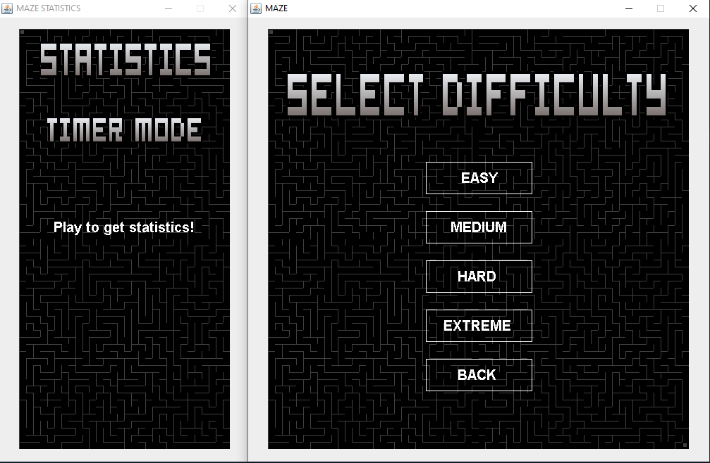

# AI_MAZE
Procedural Mazes with auto-solving AI

(This program was created for learning purposes and it was one of the first approaches to OOP, the code might be a little messy but there's always room for improvement! c: )

# THE GAME

This game is about solving new procedurally generated mazes. There's an A.I. that can solve all of them at every complexity, can you beat it by solving it faster? There are four levels: EASY, MEDIUM, HARD and EXTREME.

If you're new to the game here's a little tutorial about the game commands:

That's the hardest level in the game, can you solve it faster than the A.I.? ...Can you solve it AT ALL?!?

# MODES

Apart from the "Chronometer" mode that can be played by both the user and the A.I. there's also the "TIMER" mode that can be played only by the user.
Exclusively for user modes there are bonuses and maluses, they modify your score accordingly, so pay attention! 

# THE A.I.

This short .gif is here to show briefly how the A.I. solves the maze and it's thought process(as shown in Command Line).

The A.I. during its first steps chooses the next direction randomly (in order to obtain more variation and to avoid to get stuck in a loop).
After a while it picks only one of the actual possible directions and if it gets stuck, it goes back until it finds a new valid direction.

 

# ALGORITHMS USED
-Best First Search

-Depth First Search

-Backtracking

